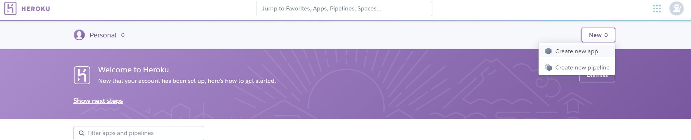

# Flight Fare Prediction:

## Table of Content
  * [Demo](#demo)
  * [Dataset](#dataset)
  * [Overview](#overview)
  * [Technical Aspect](#technical-aspect)
  * [Installation](#installation)
  * [Deployement on Heroku](#deployement-on-heroku)
  * [Directory Tree](#directory-tree)
  * [Technologies Used](#technologies-used)
  
  ## Demo
  
  Link:- https://flight-price-predictor-app.herokuapp.com/
  
  
  
  
  ## Dataset
  
  Dataset Link :-  https://www.kaggle.com/nikhilmittal/flight-fare-prediction-mh
  
  
  ## Overview
  
  This is a Flask App trained on top of sklearn. The trained model take feature like, Departure Time,   Arrival Time, Travil Duration, Number of stops and Airline as an input and predict the Fare of      that flight.
  

## Technical Aspect

This project is divided into two part:

 1. Training a Machine Learning model using sklearn.
 2. Building and hosting a Flask web app on Heroku.
 
 
## Installation

The Code is written in Python 3.6.10. If you don't have Python installed you can find it [here](https://www.python.org/downloads/). If you are using a lower version of Python you can upgrade using the pip package, ensuring you have the latest version of pip. To install the required packages and libraries, run this command in the project directory after [cloning]

## Deployement on Heroku

Login or signup in order to create virtual app. You can either connect your github profile or download ctl to manually deploy this project.

